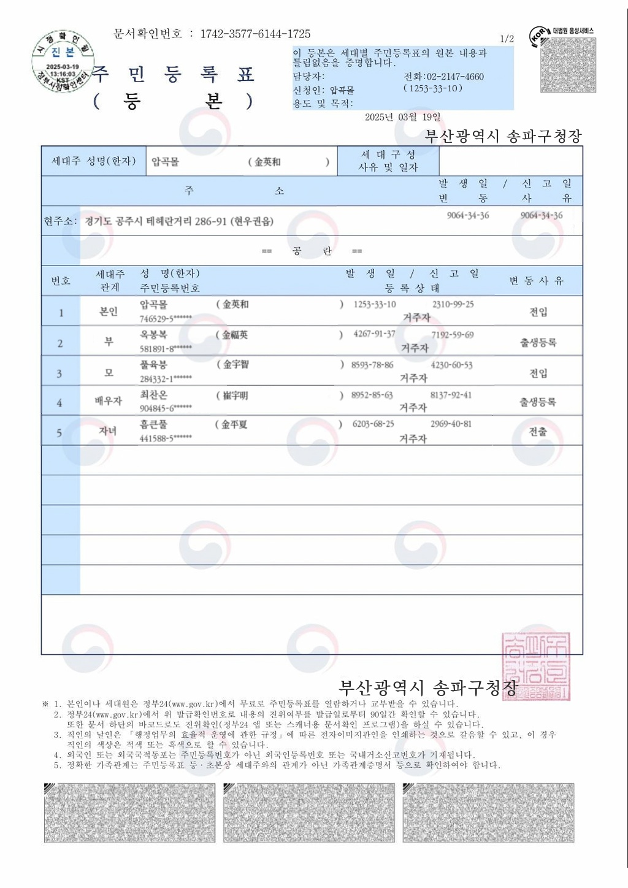
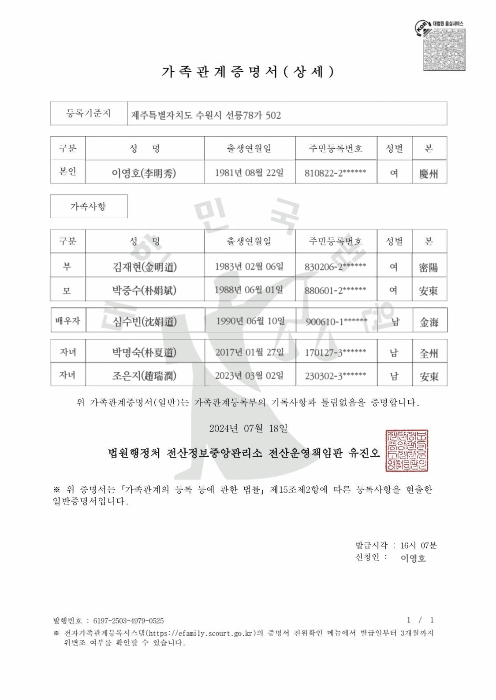

# 한국 문서 템플릿 자동 생성 시스템 🇰🇷

AI를 활용한 한국 공식 문서 템플릿 자동 생성 및 합성 시스템입니다.
가족관계증명서와 주민등록등본을 실제와 유사하게 생성하면서도 완전한 가짜 데이터를 사용하여 개인정보를 보호합니다.

## 🎯 주요 기능

### 📋 지원 문서 유형
- **가족관계증명서 (GA)**: 본인, 부모, 배우자, 자녀 정보 포함
- **주민등록등본 (JU)**: 세대주 및 세대원 정보 포함

### 🔐 개인정보 보호
- **완전 가짜 이름**: 한국어 음절 조합으로 자연스럽지만 가짜인 이름 생성
- **무작위 숫자**: 실제 날짜/주민번호와 겹치지 않는 완전 랜덤 숫자
- **가짜 한자명**: 의미 있는 한자 조합으로 실제감 있는 한자명 생성

### 🎨 시각적 완성도
- **정밀한 레이아웃**: YAML 설정으로 픽셀 단위 위치 조정
- **한국어 폰트**: KoPub World Batang Medium 폰트 사용
- **시각화 도구**: 필드 박스 표시로 레이아웃 검증 가능

## 📁 프로젝트 구조

```
kdocs_synth/
├── src/                          # 핵심 소스 코드
│   ├── templates_juga.py         # 템플릿 렌더링 엔진
│   ├── data_factory.py           # 가짜 데이터 생성기
│   ├── extract_layout.py         # 레이아웃 추출 도구 (GUI)
│   └── compare_methods.py        # 방법론 비교 도구
├── configs/                      # 템플릿 설정 파일
│   ├── field_definitions/        # 필드 정의
│   └── *_layout.yaml            # 레이아웃 좌표 설정
├── assets/                       # 리소스 파일
│   ├── templates/               # 원본 템플릿 이미지
│   ├── fonts/                   # 한국어 폰트
│   └── samples/                 # 샘플 이미지
└── outputs/                      # 생성 결과물
    ├── dataset/                 # 대량 생성 데이터셋
    └── test_*.jpg               # 테스트 결과 이미지
```

## 🚀 빠른 시작

### 1. 환경 설정
```bash
# 의존성 설치
pip install pillow opencv-python numpy pyyaml faker

# 한국어 패키지 설치
pip install faker[ko-KR]
```

### 2. 단일 문서 생성
```bash
python src/templates_juga.py
```

### 3. 대량 데이터셋 생성
```bash
python main.py
```

## 📊 결과물 예시

### 주민등록등본 (JU)


**특징:**
- 신청인과 생년월일이 같은 라인에 정렬
- 한자명에 적절한 스페이스 배치: `(  한자명                       )`
- 완전 무작위 날짜: `3847.52.19` 형식
- 실제 변동사유: 전입(50%), 전출(20%), 출생등록(10%) 등

### 가족관계증명서 (GA)


**특징:**
- 본인, 부모, 배우자, 자녀 관계 표현
- 생년월일 한국어 형식: `1987년 11월 23일`
- 본관 한자 표기: `金海`, `全州` 등

### 레이아웃 시각화


## ⚙️ 주요 설정

### 데이터 생성 설정
```python
# src/data_factory.py
def generate_name():
    """한국어 음절 조합으로 가짜 이름 생성"""
    surname_syllables = ["강", "갑", "갈", ...]
    name_syllables = ["가", "간", "갈", ...]
    
def generate_date():
    """완전 무작위 숫자로 가짜 날짜 생성"""
    return f"{random.randint(1000, 9999)}.{random.randint(10, 99)}.{random.randint(10, 99)}"
```

### 레이아웃 설정
```yaml
# configs/JU_template1_TY11_layout.yaml
field_boxes:
  APPLICANT:
    - 530  # x1
    - 137  # y1  
    - 654  # x2
    - 159  # y2
  APPLICANT_BIRTH:
    - 700  # 신청인과 같은 라인
    - 137
    - 850
    - 159
```

## 🔧 커스터마이징

### 1. 새로운 템플릿 추가
1. `assets/templates/` 에 템플릿 이미지 추가
2. `extract_layout.py` GUI 도구로 필드 위치 추출
3. `configs/` 에 레이아웃 YAML 파일 생성
4. `templates_juga.py` 에 템플릿 클래스 추가

### 2. 데이터 형식 변경
- `data_factory.py` 에서 생성 함수 수정
- 변동사유, 이름 패턴, 날짜 형식 등 조정 가능

### 3. 폰트 및 스타일 조정
- `templates_juga.py` 에서 폰트 크기, 색상, 정렬 방식 수정
- 각 필드별 세밀한 조정 가능

## 📈 개발 과정

### 1단계: 기본 템플릿 구축 ✅
- 원본 템플릿 이미지 준비
- 기본 텍스트 렌더링 시스템 구축
- YAML 설정 시스템 도입

### 2단계: 레이아웃 정밀 조정 ✅
- 픽셀 단위 위치 미세 조정
- 신청인-날짜 라인 정렬
- 이름-주민번호 세로 정렬
- 한자명 스페이스 최적화

### 3단계: 개인정보 보호 강화 ✅
- 실제 이름 → 한국어 음절 조합 가짜 이름
- 실제 날짜 → 완전 무작위 숫자
- 실제 주민번호 → 의미 없는 랜덤 번호

### 4단계: 시각적 완성도 향상 ✅
- 글자 색상 진하게 조정 (60,60,60) → (30,30,30)
- 폰트 크기 최적화
- 한자명 괄호 내 스페이스 조정

## 🛡️ 개인정보 보호 정책

이 시스템은 **100% 가짜 데이터**만을 사용합니다:

- ❌ **실제 이름**: 사용하지 않음
- ❌ **실제 주민번호**: 사용하지 않음  
- ❌ **실제 주소**: faker 라이브러리 가짜 주소 사용
- ❌ **실제 날짜**: 완전 무작위 숫자 사용

✅ **AI 학습, 테스트, 데모 목적으로 안전하게 사용 가능**

## 🤝 기여 방법

1. Fork the repository
2. Create your feature branch (`git checkout -b feature/AmazingFeature`)
3. Commit your changes (`git commit -m 'Add some AmazingFeature'`)
4. Push to the branch (`git push origin feature/AmazingFeature`)
5. Open a Pull Request

## 📄 라이선스

이 프로젝트는 MIT 라이선스 하에 배포됩니다. 자세한 내용은 `LICENSE` 파일을 참조하세요.

## 🙏 감사의 말

- **KoPub World Batang** 폰트 제공
- **Faker** 라이브러리를 통한 가짜 데이터 생성
- **OpenCV & Pillow** 이미지 처리 라이브러리

---

**⚠️ 주의사항**: 이 시스템은 교육 및 연구 목적으로만 사용되어야 하며, 실제 공문서 위조나 불법적인 용도로 사용해서는 안 됩니다. 